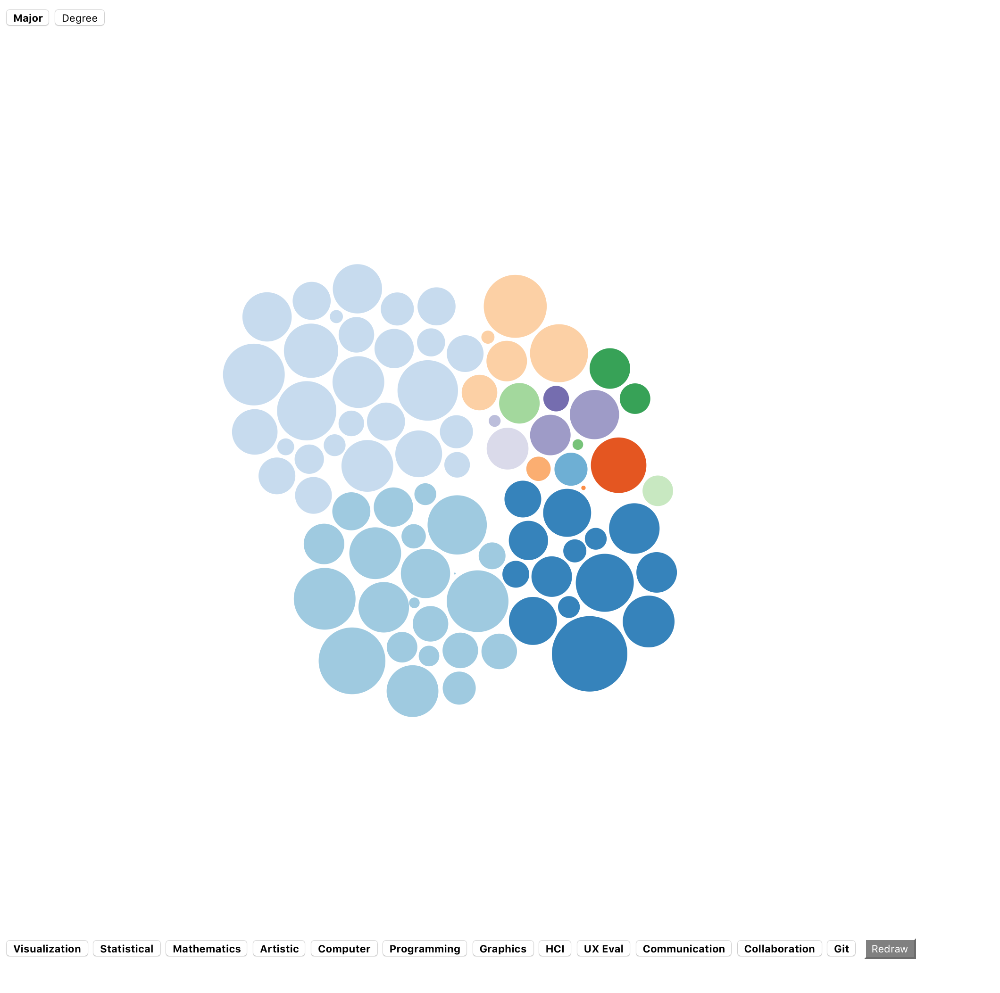

Viktor Ceder, vceder@kth.se

link: https://techpriestv.github.io/infovizp1/

I've chosen to let the user do the heavy groundwork in building the groups but I believe my visualisation would work as a great tool for that task.

Every person is represented as a circle with their skill levels determining its radius and they group by the filter picked up in the left corner.

You can turn on or off different skills you want to be represented at the bottom 

To get more information about a student you can hover your mouse over them and thus getting their name alias, numeric skill value and what they were grouped by.

I would have liked to get some functionality so that you can add the circles to a pile to further help in group  making but there was not enough time for that for me this time.